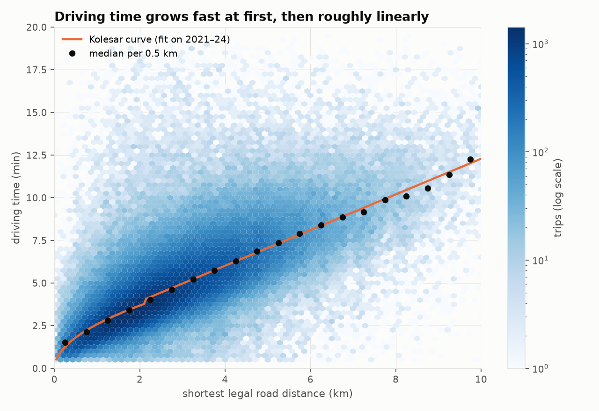
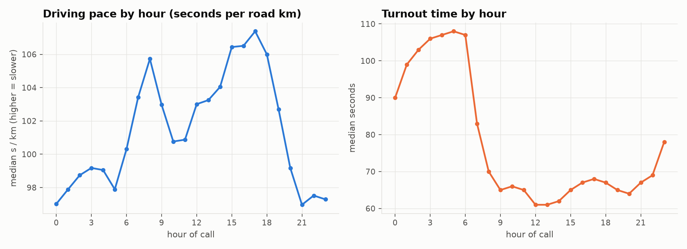
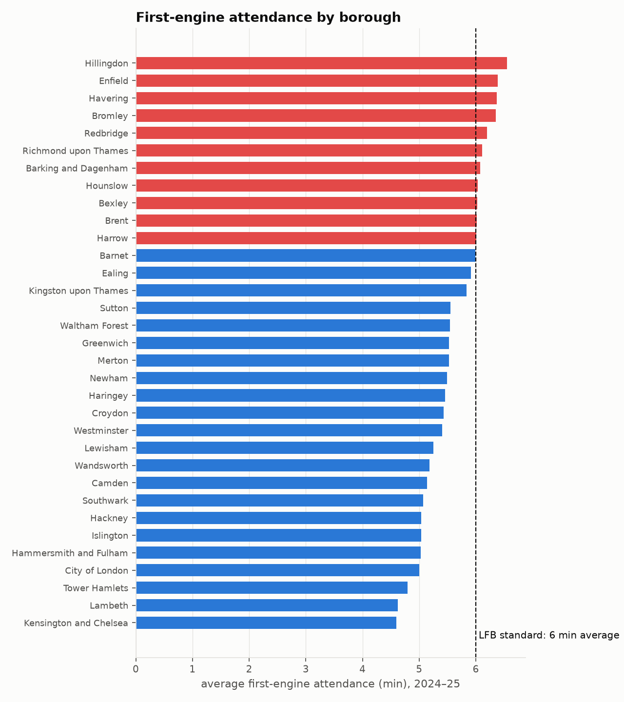
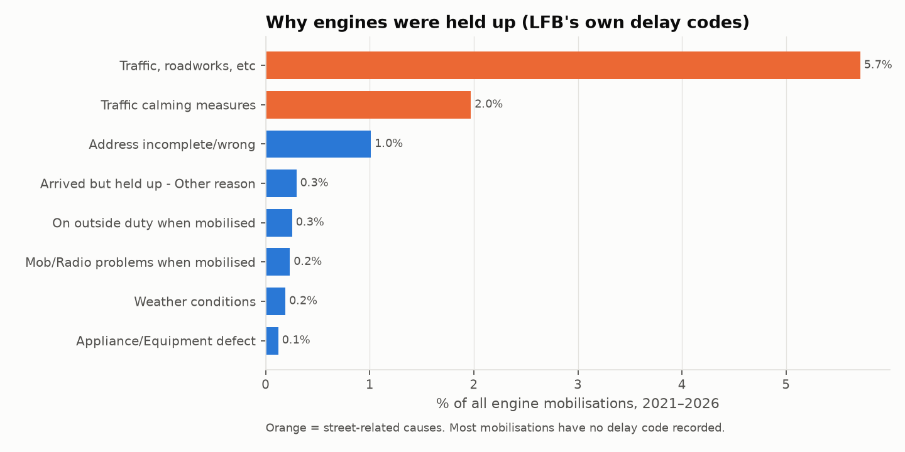
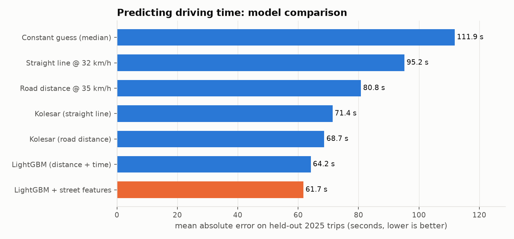
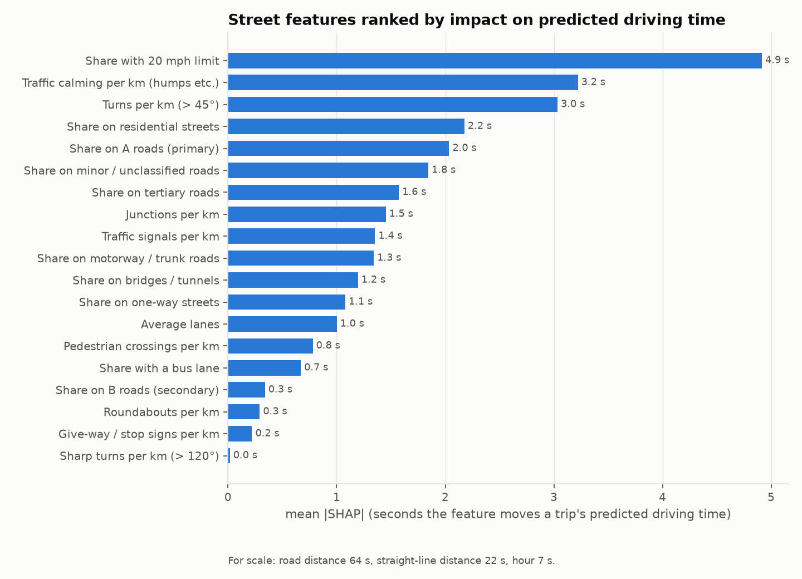
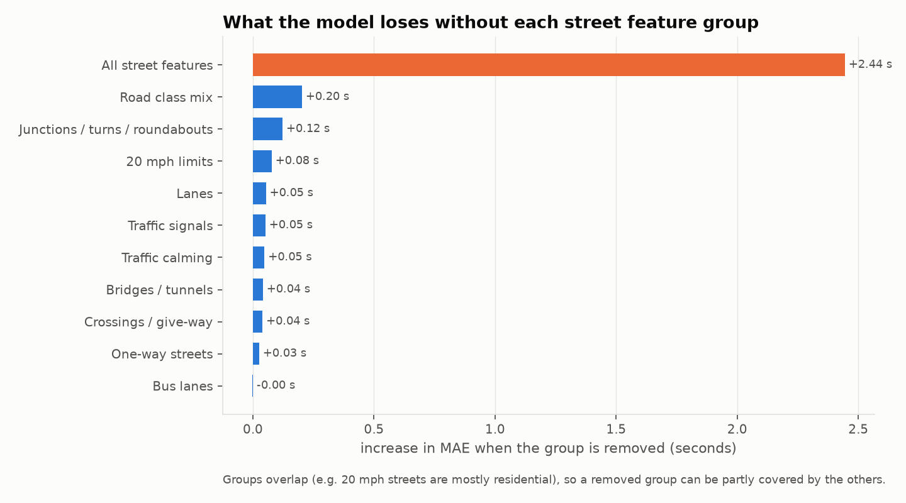
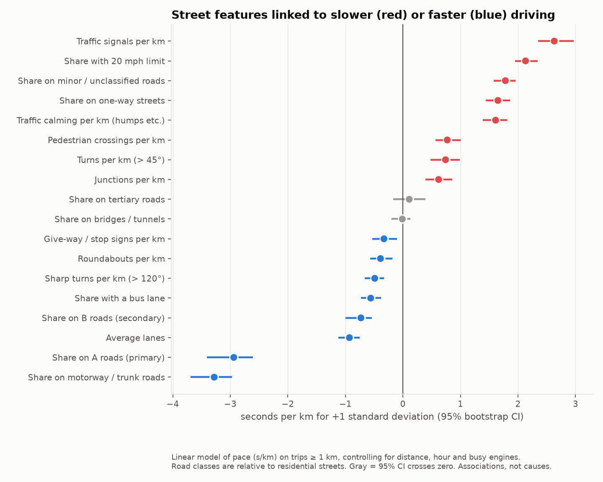
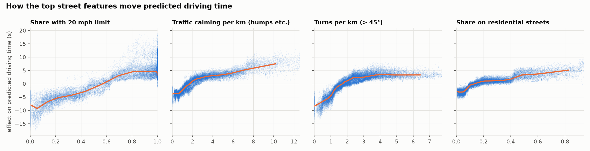

# Initial analysis of the London data

Produced by `scripts/analyze_london.py` from 1,024,833 LFB engine trips (2021 → mid-2026,
mobilisation records joined to incident locations) and the 2024–25 planner incidents.
Figures and every number below are in `data/figures/london_eda/` (`summary.json`).

Street features describe each trip's **shortest legal route** on the OpenStreetMap
drive graph (one-way streets respected), not the route the engine actually drove.
All street effects are **associations, not causes**.

## The data at a glance

- Median trip: **2.5 km** of road, **4 min 25 s** driving (`TravelTimeSeconds`), plus
  **71 s** turnout.
- Driving time follows the Kolesar shape: fast growth on short trips while the engine
  accelerates, then roughly linear (about 1 min per km beyond 2 km).
- Engines are about **10 % slower in the rush hours** (≈ 106 s/km at 08:00 and 17:00
  vs ≈ 97 s/km at night).
- Turnout is far longer at night (**≈ 105 s at 03:00–06:00** vs ≈ 62 s at midday): crews
  are asleep, which matters because LFB's standard counts from mobilisation.
- **11 outer boroughs average over the 6-minute first-engine standard** in 2024–25
  (Hillingdon, Enfield, Havering, Bromley, Redbridge, Richmond, Barking & Dagenham,
  Hounslow, Bexley, Brent, Harrow). Inner London averages 4.6–5.5 min.
- LFB's own delay codes blame **traffic / roadworks for 5.7 %** of all mobilisations and
  **traffic calming for 2.0 %**, the two most common recorded causes.

| | |
|---|---|
|  |  |
|  |  |

Also: `01_time_distributions.png`, `06_monthly_drive_time.png`.

## Do street features improve the model?

Yes, modestly. Trained on 2021–24, tested on 200,624 trips in 2025:

| Model | MAE |
|---|---|
| Constant guess | 111.9 s |
| Straight line @ 32 km/h | 95.2 s |
| Road distance @ 35 km/h | 80.8 s |
| Kolesar (straight line) | 71.4 s |
| Kolesar (road distance) | 68.7 s |
| LightGBM (distance + time) | 64.2 s |
| **LightGBM + street features** | **61.7 s** |

Street features take another **2.5 s (4 %)** off the error on top of road distance.

## Which street features matter most

Three views, which broadly agree:

**1. SHAP (how much each feature moves a trip's prediction, in seconds).**
Top five: **20 mph share (4.9 s)**, **traffic calming per km (3.2 s)**, **turns per km
(3.0 s)**, residential-street share (2.2 s), A-road share (2.0 s). For scale, road
distance moves predictions by 64 s on average.

**2. Drop one group at a time.** Removing all street features costs 2.44 s of MAE, but
removing any single group costs at most 0.2 s (road class mix), because the groups
overlap: 20 mph streets are mostly residential, calmed and turny. The street signal is
real but shared across correlated features.

**3. Seconds per km (pace regression, 95 % bootstrap CIs).** On trips ≥ 1 km,
controlling for distance, hour and busy engines (median pace ≈ 100 s/km), converted to
natural units:

| Feature | Effect on pace |
|---|---|
| Traffic signals | **+0.5 s/km per extra signal per km** |
| Route entirely 20 mph (vs none) | **+5.6 s/km** |
| Route entirely one-way (vs none) | +7.5 s/km |
| Traffic calming | **+0.6 s/km per extra hump/feature per km** |
| Route entirely A road (vs residential) | **−9.2 s/km** |
| Route entirely motorway / trunk (vs residential) | −13.1 s/km |
| Each extra lane (average) | −2.4 s/km |
| Route entirely bus lane (vs none) | −4.7 s/km |

How the top features act (SHAP dependence): the 20 mph effect rises steadily from about
−8 s to +5 s as a route goes from no 20 mph streets to mostly 20 mph; traffic calming and
turns rise steeply at first and then level off.

## Reading these honestly

- **Slow:** traffic signals, 20 mph limits, one-way streets, traffic calming, crossings.
  **Fast:** A roads, trunk roads, more lanes, bus lanes.
- A few signs are surprising (give-way signs, roundabouts and sharp turns go with
  *faster* pace). They are probably proxies for outer-London suburban roads, which are
  faster for other reasons. This is why these are associations, not causes.
- The 20 mph effect cannot be separated from what 20 mph streets are like (narrow,
  parked cars, residential); see `PROJECT_OVERVIEW.md` on why a real street change would
  be needed to test cause.
- Bus lanes are under-tagged in OpenStreetMap (2,213 segments), so that effect is the
  least reliable.
- Next: test whether routing on learned per-street speeds (instead of shortest distance)
  changes these results, and add OS NGD width / speed data.
